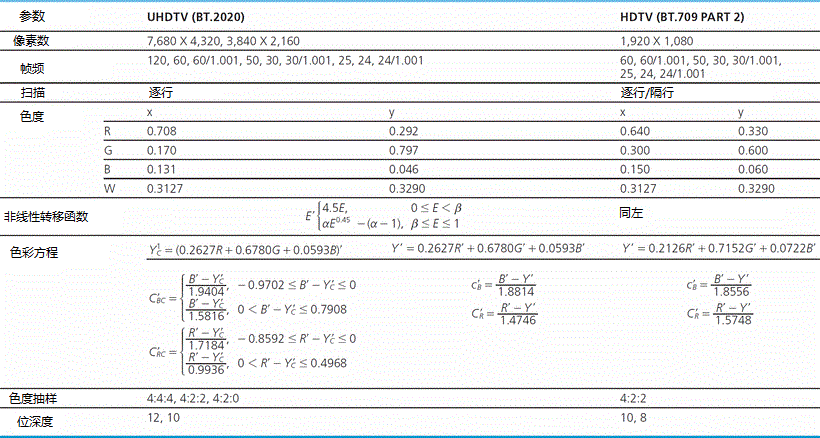
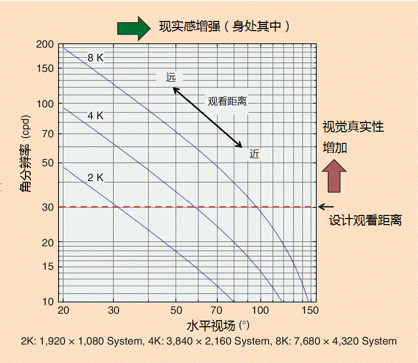
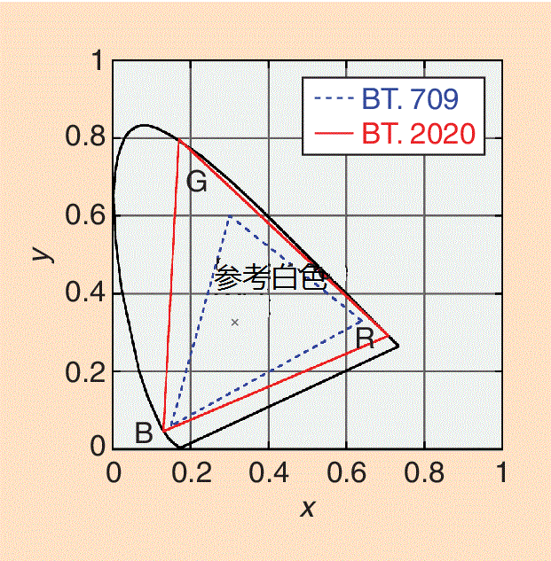

# 超高清电视(Rec. ITU-R BT.2020)：电视进化史上跨时代的飞跃[标准概述]

> 原著：Masayuki Sugawara, Seo-Young Choi,and David Wood

> 原文链接：[Ultra-High-Definition Television \(Rec. ITU-R BT.2020\): A Generational Leap in the Evolution of Television \[Standards in a Nutshell\]](http://ieeexplore.ieee.org/xpls/icp.jsp?arnumber=6784055&tag=1)

---

国际电信联盟无线电通信部门(ITU-R)于2012年8月发布了Rec. ITU-R BT.2020——“超高清电视系统在生产及国际节目交换中的参数值” [1]。电视系统的参数大致相当于图像格式,包括像素数、帧频、色度。这些基本的系统参数决定了系统根据视场(FOV)大小,运动描绘的质量和色彩再现的准确性可以提供给观众怎样的视觉体验。

技术总是在一代又一代地进步,但一代电视技术的持续时间却要长于许多其他领域,比如信息技术(IT)。黑白标清电视出现以来，电视技术只发生过两次主要变化——彩色电视的出现和高清电视(HDTV)的传播。

电视系统的改变相对较慢是由于电视系统或服务的特点:为了降低整个系统的成本,一个电视广播系统包括一些昂贵的传输部分和许多便宜的接收部分。该系统还需要严格的标准来支持在尽可能广泛的地区进行节目交换。目前,高清电视正在全球或多或少地普及开来。一些先进的国家和广播机构对高清电视之后的下一代电视的兴趣正在增长。这个新的电视格式称为超高清电视(UHDTV),也因其在水平方向的近似像素数被称为4 K或8 K。Rec.BT.2020指定了这种电视的系统参数。本文介绍了Rec BT.2020中对超高清电视的定义,重点强调主要参数值确定的背景。

## 一、背景

国际电信联盟无线电通信部门活动的主要目标之一就是为有限的无线频谱资源的有效利用提供环境,确保所需的无线电通信系统的性能和质量。这就是主要负责范围是无线电通信的ITU-R去处理电视图像格式标准化的原因。特定的广播服务需要从广播机构的节目源到节目显示的用户端的端对端链的最优化系统，也需要国际节目交流。在模拟时代,电视图像格式是直接连接到所需带宽的无线电波和调制路径。如今广播链已经数字化,图像格式主要是致力于提高终端用户的视觉体验。

直到现在,虽然在促进节目顺利交换和低价设备上的成果令人满意，但是还没有完美的世界统一的电视系统标准。例如,三色电视系统在1970年的ITU-R Rec. BT. 470 [2]中标准化的，它发展成了现在我们说的标清电视[3]。这些标准指定625/50和525/60系统的帧频(或场频)为50和60赫兹,分别意味着：625或525表示扫描线的数量，50或60表示帧频(或场频)。一个格式没有标准化有各种原因，就帧频来说,电力线路的频率在欧洲和美国分别为50Hz和60 Hz对决定标准有很大的不良影响,因为采取相同的值对现今的科技是有利的。

1972年日本的提议开启了ITU-R [4]对高清电视的研究。高清电视的标准主要关注的是扫描线(像素数)和帧频的增加,尽管它也对色度等其他参数进行了研究。由于存在对标清电视向后兼容性的意见冲突，这个过程花了很长时间。Rec. ITU-R BT.709 [5]的第一个版本在1990年提出，然而它只指定了长宽比和色度,扫描线和帧频率仍在研究之中。最终, 2000年的第四版实现了除帧频外的全球统一的高清电视系统参数。这简化了在50和60 Hz之间区域节目交换的格式转换，帧频成了唯一需要考虑的因素。

## 二、标准流程
1993年，高清电视标准Rec. BT.709确立过后不久，超越高清电视的电视系统的研究开始了。它当初被称为超高分辨率图像，旨在标准化广播和非广播应用的高分辨率视频的方法。研究结果反映在ITU-R Rec.BT. 1201 [6]上。标准其中一个建议内容如下:

> 电视系统空间分辨率图像采集和显示的电子设备应该与基于建议ITU-R BT.709的水平1920像素垂直1080像素成简单整数比。

ITU-R对超高清电视的下一步研究被称为大屏幕数字图像(LSDI)。LSDI被定义为一个适用于戏剧、戏剧、体育赛事、音乐会、和文化盛事等节目、集拍摄和在设备允许的剧院、大厅等场所进行高分辨率品质大屏幕显示于一体的数字图像系统。LSDI的扩展版本已经进行过研究并且推出了Rec. ITU-R BT.1769。它指定了7680×4320和3840×3840的系统。除了像素数以外的其他参数同Rec. BT.709 或 Rec. BT.1361 [7]相同。

高清电视在全球范围已经在稳定地推广,一些先进的国家和广播公司开始考虑下一代电视系统及其标准化，而超高清电视使用的图像格式的应用还正在研究中。据此,ITU-R通过2008年ITU-R's Study Group (SG) 6峰会作出提议开始研究超高清电视。研究的框架已经决定，一个理事组织也随之成立(理事组织是一个在SG6峰会两年的会期间隔期间指挥工作来加快研究的体制)。四年的努力研究使得Rec. BT.2020在2012年8月被确立。详细的研究结果被编著在ITU-R Rep. BT.2246 [8]中。

## 三、主要特点
Rec.BT.2020中指定的主要参数及其值在表1中列出。从标清电视到高清电视的演变只改变了像素数，而从高清电视至超高清电视的进化包含了新增的帧频和色度。在这方面,Rec.BT.2020将给这一领域带来数十年一遇的重大变化。Rep. BT.2246所描述的研究的概念基础如下:

> 1.超高清电视将是一个通过提供事实上覆盖所有人视场的宽视场来为观众提供更好的视觉体验并且维持甚至提升了高清电视其他特点的电视应用。超高清电视可以被描述为一个有着宽视场和加强版空间分辨率支持的电视系统。

*表 1 超高清电视与高清电视的参数比较*

## 四、像素数

超高清电视的首要目的是扩大视场。像素数是在确定系统参数时的主要考虑因素,因为它在保持图像质量的同时满足扩大视场的主要目标,这主要是受角分辨率的影响。为确定超高清电视所需的像素数进行了许多主观和客观的实验，这些实验关注视场和真实感(“身处其中”的感觉)之间的关系。结果表明,直到视场增加到100°左右时现实感一直上升 [9]。

另一个用例可以说明增加像素数增加的不仅有视场还有角分辨率。更高的像素数导致同样的屏幕大小和绝对的观看距离下角分辨率的增加。对于传统电视, 设计观看距离在角分辨为30周期/度(cpd)时,图像质量最好 [10]。这是通常被认为的“最佳”观看距离。然而,实验结果表明,识别能力(用自然图像度量的视觉灵敏度)和视觉真实性增加(再现图像的主观视觉保真度)在角分辨率超过30 cpd时出现 [11]。

图1绘出了三个提供不同像素数的系统的水平视场和角分辨率关系图。1920×1080(全高清电视或2 k)的系统在最佳观看距离下为达到角分辨率30 cpd需要的视场为30°。3840×2160(4 k)和7680×4320(8 k)的系统在分别保持相同角分辨率时视场可以增加到60°和100°，这导致了前面说的更强的现实感。而用更高的像素数来增加角分辨率会提高真实性。一些增加像素数的主观影响的实验结果在ITU-R文档中有描述 [8],[12]。

*图 1 高清和超高清电视系统提供的视场和角分辨率*

与此同时, Rec.BT.1201中令人满意的是超高清电视系统的像素数是高清电视的整数倍。 超高清电视的像素数被选定为水平方向和竖直方向均为高清电视的2或4倍。

## 五、帧频

逐行扫描是能考虑的唯一扫描方法，因为超高清电视只能用于数字系统。它的帧频和高清电视一样高至60Hz，此外也有的帧频为120Hz。这样做的目的是遵循有关闪烁和运动模糊的调查结果。特定频率的这两个特点和占空比，也就是显示的亮周期占整个帧持续时间的比例，产生冲突。闪烁变得越明显,运动模糊和占空比越少,反之亦然。虽然之前很多有关闪烁的研究已经进行过,研究人员又进行了一项在不同条件下比如视场、屏幕亮度和占空比适合当前的显示技术和超高清电视的新实验。结果表明,宽视场需要更高的帧频来减少闪烁感 [13]。60 Hz的帧频(高清电视的频率) 在视场为30°,即高清电视的设计观看距离，时几乎满足临界闪变频率(CFF)的要求。然而,8 k 超高清电视的视场是100°，所以需要帧频高于80Hz来满足CFF的要求。

运动模糊是即时采样和有限即时拍摄造成的其中一个主要历史遗留问题。传统的电视系统在100%来自即时拍摄和冲量式显示的基础上被设计出来，这意味着运动模糊是采集端造成的。然而,随着科技从阴极射线管发展到非阴极射线管，运动模糊这一问题被带到了显示端。一些主观测试结果表明,6 ~ 11像素/帧的模拟运动模糊是可接受的极限，这与物体以32°/s的速度移动时即时成像时间为1/320秒相一致,接近人眼的追踪极限和电视节目中物体的速度。这可以通过减少占空比或提高帧频来实现。从带宽的角度来说，稍微增加帧频是可取的。因此,采取以下方法是合理的。首先帧频应该增加到一个在任何占空比下都不会出现闪烁的值。相应的，由于摄像机和/或显示端的占空比减少，运动模糊也会减少。上述内容连同所有的运动影像质量评价结果也被记录在BT.2246中。与现有的高清电视系统兼容也是必不可少的。因此, Rec.BT.2020指定帧频增加到120Hz。

## 六、色度

系统的色度在传统电视——无论是标清电视还是高清电视——都受到显示设备的限制。简而言之,色度坐标的红绿蓝三基色是在阴极射线管荧光粉的特性的基础上确定的。然而,阴极射线管技术不可能用在超高清电视显示器上。此外,很难想象一个特定的显示技术将在未来占主导地位。在这种情况下,以下三个要求被引入来说明超高清电视的系统色度:

> 1.宽色域电视的色度应该涵盖现存电视系统和其他有关的非广播系统的所有颜色。

> 2.宽色域电视的颜色编码效率应该与当前使用的广播系统相当。

> 3.用于宽色域电视的每个颜色应该可以显示在参考监视器上，这样广播机构才能监视和控制图像质量。

因此,国际上约定使用真实物理色来作三基色，具体数值反映在表1和图2中。波长为467nm、532nm、630nm的单色分别对应蓝色、绿色、红色。

*图 2 高清和超高清电视系统的三基色和参考白色色度坐标*

在高清电视时代和更早些时候,亮度(Y)信号并不代表真正的亮度(非常数的亮度)，这是伽马校正和Y信号计算的顺序造成的。在目前的系统中,R、G、B信号的伽马校正在Y信号,也被称为“亮度”,之前进行计算。正是这伽马校正之后的Y计算导致了稍微偏离真正亮度。 虽然这对主观图像质量只有一点小的影响,却是电视工程师之间的普遍问题,大部分电视工程师认为迟早应该引入一个恒定的亮度系统。另一方面,当前非常数的亮度方式(例如,信号处理操作,像添加两个图片,可以通过伽马校正亮度和色差空间,因为它们是伽马校正RGB信号的线性组合)鲜为人知的好处通过ITU-R的活动被逐渐知晓。考虑到常数和非常数的方法的优缺点,BT.2020制定的时候把两种方法写在一起。

关于色度二次抽样,4:2:0和4:4:4的比率由于其适用于逐行扫描被加入;关于位深度,8位深度下降,增加了12位深度来更好地贴合人类视觉系统(HVS) 的对比敏感。

## 七、总结
超高清电视是电视的跨时代的改变，将为观众提供更好的视听体验。有效且高效地实现超高清电视系统需要新技术来促进这样的体验。此外,接收器和内容必须以合理的价格提供给用户。

我们相信Rec.BT.2020满足这些关于视频的需求。它们的表现很好地贴合了人类视觉系统。同时,最近的4 K – 8K分辨率电视系统和数字影院系统的雏形已经证明了其基于当前或近期技术的可行性。

系统参数的确定是电视系统发展的第一步。系统参数及其国际标准化的共识将加快针对超高清电视广播服务起步的技术和设备的发展。

## 八、资源
ITU主页 (www.itu.int) 已经能查看ITU-R的所有出版物。ITU会员能获取贡献文档来进行超高清电视的研究。

### 鸣谢
作者对WP6C的贡献者表示感谢，他们的卓越工作使得Rec.BT.2020得以确立。

### 作者简介
Masayuki Sugawara (sugawara.m-fq@nhk.or.jp)是日本NHK科技研究实验室高级电视系统研究部门的领头人。他自2004年来一直是ITU-R SG6的活跃贡献者。

Seo-Young Choi (seoyoung228@gmail.com)是韩国三星电子股份公司三星科技高级研究所的研发人员。她积极参与ITU-R的超高清电视基带图像格式标准化。

David Wood (wood@ebu.ch)是瑞士日内瓦欧洲广播联盟的科创顾问。他担任世界广播联盟技术委员会、ITU-R Working Group 6P、3D电视和超高清电视数字视频广播组织的主席。

### 参考文献
[1] “Parameter values for ultra-high definition television systems for production and international programme exchange,” Recommendation ITU-R BT.2020, Aug. 2012.

[2] “Conventional analogue television systems,” Recommendation ITU-R BT.470-7, Feb. 2005.  

[3] “Studio encoding parameters of digital television for standard 4:3 and wide screen 16:9 aspect ratios,” Recommendation ITU-R BT.601-7, Mar. 2011. 

[4] M. I. Krivocheev and S. N. Baron, “The first twenty years of HDTV: 1972-1992,” SMPTE Motion Imaging J., vol. 102, no. 10, pp. 913–930, Oct. 1993. 

[5] “Parameter values for the HDTV standards for production and international programme exchange,” Recommendation ITU-RBT.709-5, Apr. 2002.

[6] “Extremely high resolution imagery,” Recommendation ITU-R BT.1201-1, Mar. 2004. 

[7] “Worldwide unified colorimetry and related characteristics of future television and imaging systems,” Recommendation ITU-R BT.1361, Feb. 1998.  

[8] “The present state of ultra-high definition television,” Report ITU-R BT.2246, 2012. 

[9] M. Sugawara, K. Masaoka, M. Emoto, Y. Matsuo, and Y. Nojiri, “Research on human factors in ultra-high-definition television to determine its specifications,” SMPTE Motion Imaging J., vol. 117, no. 3, pp. 23–29, Apr. 2008. 

[10] “Relative quality requirements of television broadcast systems,” Recommendation ITU-R BT.1127, July 1994.

[11] K. Masaoka, Y. Nishida, M. Sugawara, E. Nakasu, and Y. Nojiri, “Sensation of realness from high-resolution images of real objects,” IEEE Trans. Broadcast., vol. 59, no. 1, pp. 72–83, Jan. 2013.

[12] “Parameter values for an expanded hierarchy of LSDI image formats for production and international programme exchange,” Recommendation ITU-R BT.1769, July 2006.  

[13] M. Emoto and M. Sugawara, “Critical f usion frequency for bright and wide field-of-view image display,” J. Display Technol., vol. 8, no. 7, pp. 424–429, July 2012.

[14] M. Sugawara, M. Emoto, K. Masaoka, Y. Nishida, and Y. Shishikui, “SUPER Hi-VISION for the next generation television: Determination of system parameters,” ITE Trans. MTA, vol. 1, no. 1,  pp. 27–33, Jan. 2013.
